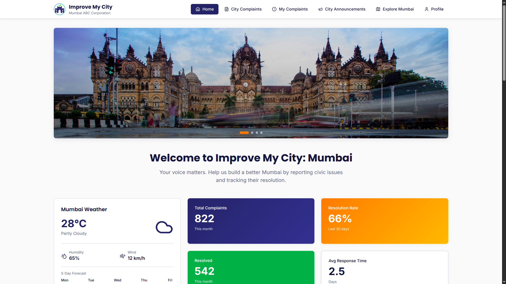
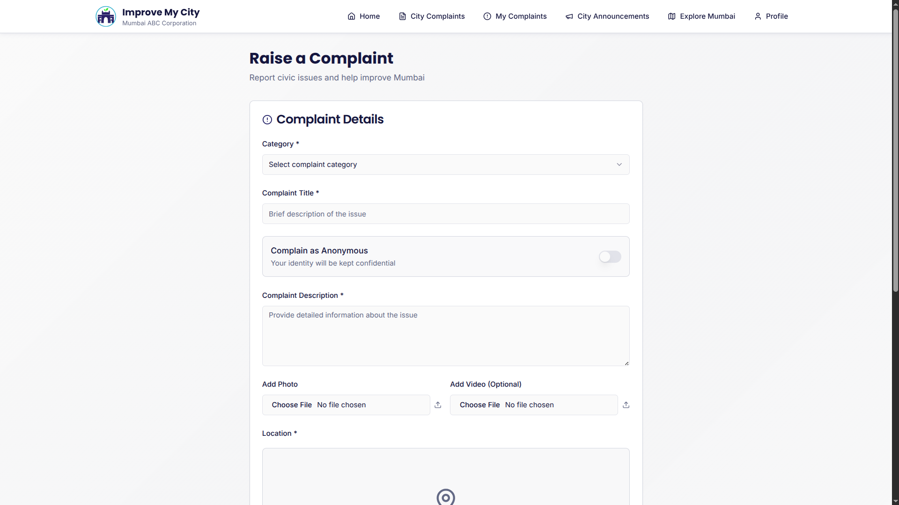
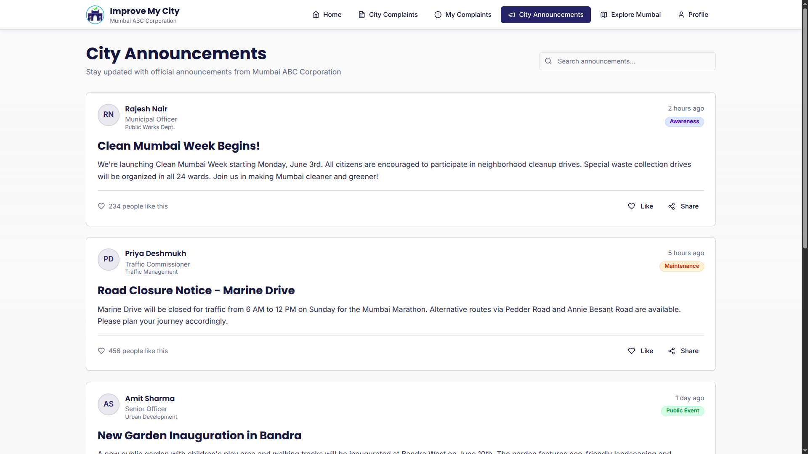
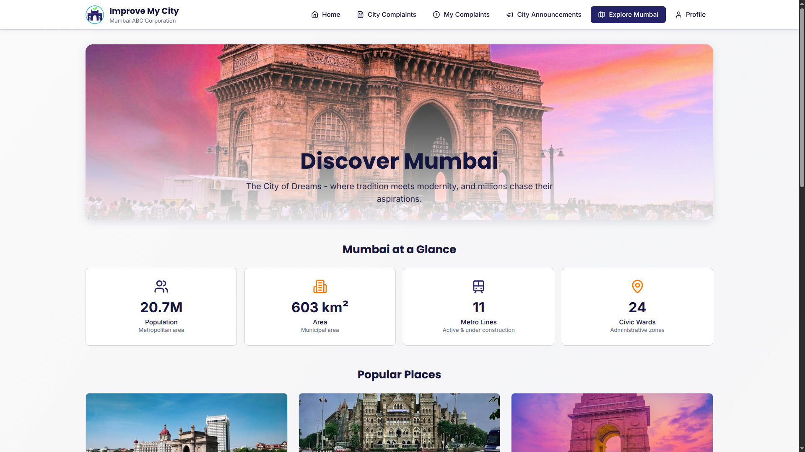
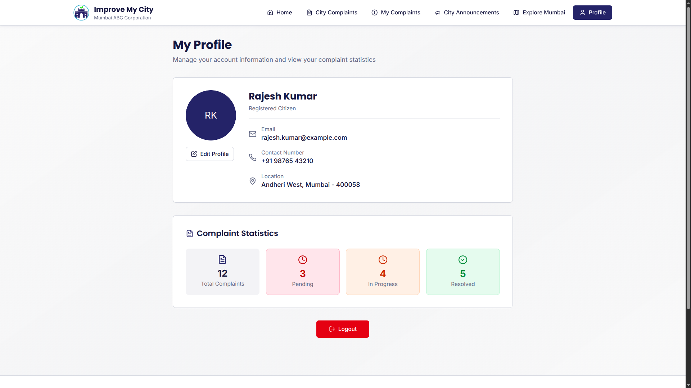
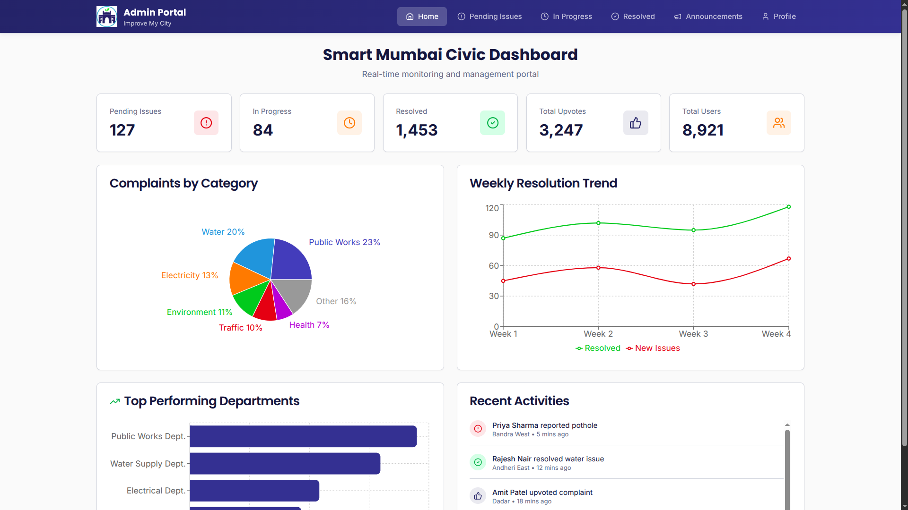

# 🏙️ Improve My City – Mumbai  
### A Smart Civic Issue Reporting Web App  
> Frontend Repository  

---

## 🌟 Overview  
**Improve My City – Mumbai** is a modern web application designed to help citizens of Mumbai easily **report, track, and view civic issues** such as potholes, streetlight failures, garbage, and water problems — while ensuring transparency through public dashboards and progress tracking.

Citizens can raise complaints, upvote existing ones, and explore their city updates — all in one place.  
The interface follows an **official government-style design** with a clean, accessible, and mobile-friendly UI.

---

## 🚀 Features  

### 👥 User Portal  
- **User Authentication** with Email, Password, and OTP verification  
- **Interactive Dashboard** with tabs:
  - 🏠 **Home:** Overview, stats, city images, weather, and complaint analytics  
  - 📢 **Announcements:** Public notices and awareness posts from authorities  
  - 🧾 **City Complaints:** Public board showing all civic complaints with upvotes and filters  
  - ✍️ **My Complaints:** User’s personal complaints (pending, in-progress, resolved)  
  - 🌆 **Explore Mumbai:** Beautiful, animated city view with data, places, and civic highlights  
  - 🙍 **Profile:** Editable profile with details, stats, and picture upload  

### 💡 Complaint System  
- Raise new complaints with:
  - Category dropdown (Public Works, Water, Electricity, Traffic, etc.)  
  - Anonymous submission toggle  
  - Text, image, and video uploads  
  - Location tagging using **Google Maps API**  
- Complaint states: **Pending → In-Progress → Resolved**  
- Users can **upvote** complaints for prioritization  
- Real-time updates and progress tracking  

### 📰 Announcements  
- Centralized announcement board from administrators  
- Cards include:
  - Admin profile, designation, timestamp, and body text  
  - Category badge & optional banner image  
  - Like / Share / Read More interactions  

### 🌐 Explore Mumbai  
- Dynamic map view, city insights, and data visualization  
- Highlights civic progress and public amenities  
- Polished UI inspired by official government websites  

---

## 🧰 Tech Stack  
| Layer | Technology |
|-------|-------------|
| **Frontend Framework** | React.js |
| **Styling** | Tailwind CSS / CSS3 |
| **State Management** | React Hooks & Context |
| **Maps Integration** | Google Maps API |
| **Icons & Animations** | Lucide Icons / Framer Motion |
| **Deployment** | Vercel |

---

## 🖼️ Preview

<table>
  <tr>
    <td align="center"> <b>🏠 Home Page</b></td>
    <td align="center"> <b>🧾 Raise Complaint</b></td>
  </tr>
</table>

<table>
  <tr>
    <td align="center"> <b>📢 Announcements</b></td>
    <td align="center"> <b>🌆 Explore Mumbai</b></td>
  </tr>
</table>

<table>
  <tr>
    <td align="center"> <b>👤 User Profile</b></td>
    <td align="center"> <b>🛠️ Admin Portal</b></td>
  </tr>
</table>

---

## 🧠 Future Enhancements  
- Push/email notifications for complaint updates  
- Role-based dashboards for multiple departments  
- AI chatbot for “Complaint Status” queries  
- Data analytics dashboard for authorities  

---

## 💻 Deployment  
Frontend hosted on **Vercel**  
👉 [Live Demo](https://improvemycity-two.vercel.app/)

---

## 🧑‍💼 Contributors  

| Rahul Srivastava |
| Aditya Yadav |
| Shakti Suraj |

---

## 🛡️ License  
This project is created solely for **educational and hackathon purposes**.  
© 2025 Team *Improve My City – Mumbai*. All rights reserved.
